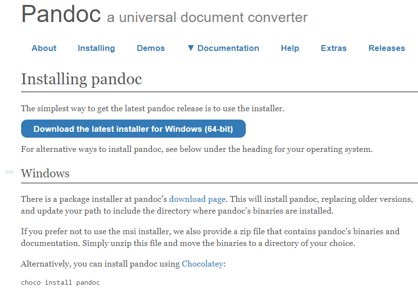

# Welcome!
Hello Students! This is a step-by-step guide on how to download and install Pandoc. Pandoc is used to convert plain-text documents and is a helpful took for technical communication. 
# How to Download and Install Pandoc

## Tools 
-	Access to internet 
-	Pandoc website 

## Steps 
1)	Go to [pandoc.org](https://pandoc.org/installing.html) **(Figure 1)** 

<figure>

<figcaption>Figure 1: Pandoc Installation Page</figcaption>
</figure>

2)	Follow instructions on the installation process according to the software of your device
3)	Check to see if Pandoc was installed correctly 
    - Open the Command Prompt/computer terminal 
    - Type `"pandoc -v"` exactly as shown   

If the installation process was successful, the programming of Pandoc will be written in the Command Prompt/computer terminal.
 

 [Back to Home Page](index.md) 